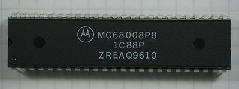
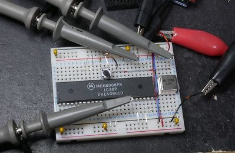

# UK108 #

Software to run on a 68008 chip, adapted to fit a
[Compukit UK101](https://en.wikipedia.org/wiki/Compukit_UK101 "Wikipedia: Compukit UK101").

The UK101 is a 6502-based machine first seen in 1979 as a series of
articles in _Practical Electronics_ magazine.

## The Freerun EPROM ##

The file 'test.asm' is for use with a freerun rig comprising a
[68008](https://en.wikipedia.org/wiki/Motorola_68008 "Wikipedia: Motorola 68008")
chip and an
[EPROM](https://en.wikipedia.org/wiki/EPROM "Wikipedia: EPROM").
With no RAM or I/O, we can't do much.
But we can observe the bus signals and timing using an oscilloscope
and/or a logic analyser.
The code in this file is intended to explore instruction timing when
the /DTACK signal of the 68008 is grounded.

## The 68008 Adapter ##

It should be possible to connect a 68008 chip in place of the
original 6502 CPU.
I've already done this with a 6809 in a hand-wired adaptor.
But what to do with the 68008's extra address lines?
Fit extra RAM and ROM and map the 6502's address space into the 68008's?
Simply restrict it to 64k bytes (which seems a bit limiting)?

## The 68008 chip ##

MC68008 in a 48-pin DIL package, date coded 9610, week 10 of 1996.

## The Freerun Setup ##

Initially just a solderless breadboard and the 48-pin DIL chip.

## 68000 Assembler ##

Found on the Internet.

